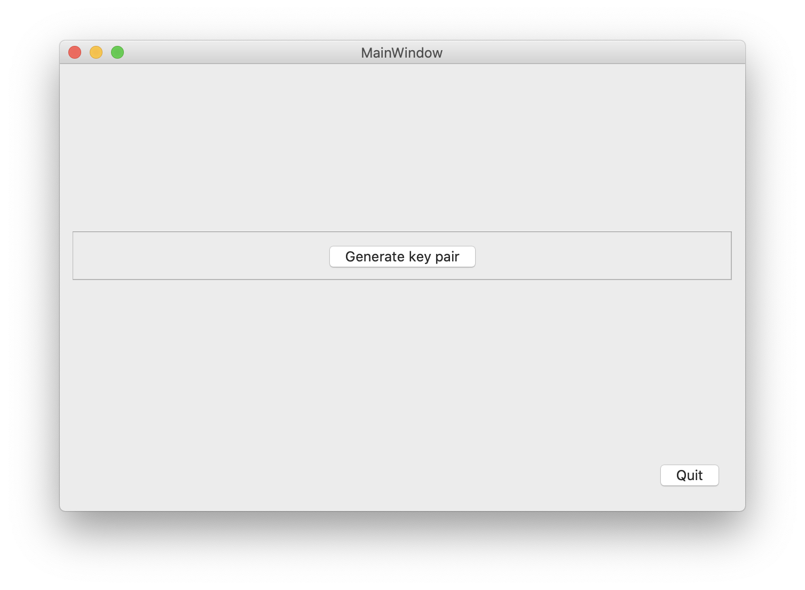

# encryption-PublicKey
Demonstration python code using pyQT for public key encryption

The following script is not intended as a full application, but just a demonstration of the technique. Firstly public and private encryption keys should be generated using script Encryption-keys.py - the public key should be located in the Encrypt folder and the private key in the Decrypt folder. In real world usage the public key is distributed to all computers for encrypting data using script Encryption-encrypt.py - the data is then transferred to the reading computer using any method, such as email or USB stick. 
Once on the reading computer the data can be decrypted using the private key and script Encryption-decrypt.py. So in summary the public key should be shared with all wishing to encrypt a message, but the private key should NEVER BE SHARED.

## Generate new Public and Private key pairs

I have included a key pair already above, with the public key located in the /Encrypt folder and the private key located in the /Decrypt folder. They are located like this as the public key should be located on the computer sending the message (encrypting) and private key located on the computer receving the message (decrypting). You can distribute the public key to all computers that you want to be able to send an encypted message, but the private key should be only on the receiving computer (never share it). The message cannot be decrypted without the private key.
The included key pair should only be used for testing and you should generate a new key pair using the script Encryption-keys.py. All messages generated using the old key pair will be undeciperable if you make new keys.

## Encrypt a message

Type the plaintext message into the edit box (maximum 400 character length) and press the Encrypt button. The message can now be save to disk by pressing the Save button and selecting a filename. Note extension will be 'txt', however if you open it in a text editor the message will be giberish.
This encrypted message can now be sent to the receiving computer using email, USB stick, etc. Remember it cannot be decrypted without the private key so is mostly safe (maybe government agencies of various countries could decipher this message - but would they bother).

## Decrypt a message

Using the Load button select the previously saved txt file. Then press Decrypt button and the original message will appear in the text box.

Date: 30 January 2021

This source code is provided by Richard J Smith 'as is' and 'with all faults'. The provider makes no 
representations or warranties of any kind concerning the safety, suitability, inaccuracies, 
typographical errors, or other harmful components of this software.

